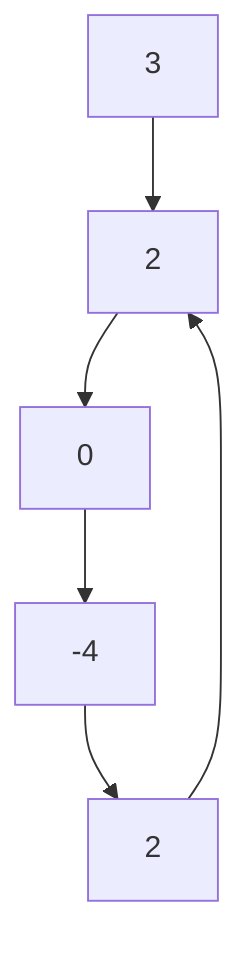

# **分配问题**

## **题目455：**

**题目描述**
   有一群孩子和一堆饼干，每个孩子有一个饥饿度，每个饼干都有一个大小。每个孩子只能吃最多一个饼干，且只有饼干的大小大于孩子的饥饿度时，这个孩子才能吃饱。求解最多有多少孩子可以吃饱。
**输入输出样例**
    输入两个数组，分别代表孩子的饥饿度和饼干的大小。输出最多有多少孩子可以吃饱的数量。
Input: [1,2], [1,2,3]
Output: 2
    在这个样例中，我们可以给两个孩子喂[1,2]、[1,3]、[2,3] 这三种组合的任意一种。
**题解**
    因为饥饿度最小的孩子最容易吃饱，所以我们先考虑这个孩子。为了尽量使得剩下的饼干可以满足饥饿度更大的孩子，所以我们应该把大于等于这个孩子饥饿度的、且大小最小的饼干给这个孩子。满足了这个孩子之后，我们采取同样的策略，考虑剩下孩子里饥饿度最小的孩子，直到没有满足条件的饼干存在。
    简而言之，这里的贪心策略是，给剩余孩子里最小饥饿度的孩子分配最小的能饱腹的饼干。至于具体实现，因为我们需要获得大小关系，一个便捷的方法就是把孩子和饼干分别排序。这样我们就可以从饥饿度最小的孩子和大小最小的饼干出发，计算有多少个对子可以满足条件。

```c++
#include<iostream>
#include<vector>
#include <algorithm>//包含sort()函数
using namespace std;
int findContentChildren(vector<int>& children, vector<int>& cookies) 
{
	sort(children.begin(), children.end());
	sort(cookies.begin(), cookies.end());
	int child = 0, cookie = 0;//作为下标，同时计数！
	while (child < children.size() && cookie < cookies.size())
	{
		if (children[child] <= cookies[cookie]) child++;//如果孩子的饥饿度小于食物，那么这个孩子就加1；
		cookie++;
	}
	return child;
}

int main()
{
	vector<int> ch ;
	ch.push_back(1);//依次将1 2放入容器中；
	ch.push_back(2);
	vector<int> co;
	co.push_back(1);
	co.push_back(2);
	co.push_back(3);
	cout << findContentChildren(ch, co) << endl;
	return 0;
}
```

运行结果：

```c++
2
```

## **题目135：**

**题目描述**
    一群孩子站成一排，每一个孩子有自己的评分。现在需要给这些孩子发糖果，规则是如果一个孩子的评分比自己身旁的一个孩子要高，那么这个孩子就必须得到比身旁孩子更多的糖果；所有孩子至少要有一个糖果。求解最少需要多少个糖果。
**输入输出样例**
    输入是一个数组，表示孩子的评分。输出是最少糖果的数量。
Input: [1,0,2]
Output: 5
    在这个样例中，最少的糖果分法是[2,1,2]。
**题解**
    做完了题目455，你会不会认为存在比较关系的贪心策略一定需要排序或是选择？虽然这一道题也是运用贪心策略，但我们只需要简单的两次遍历即可：把所有孩子的糖果数初始化为1；先从左往右遍历一遍，如果右边孩子的评分比左边的高，则右边孩子的糖果数更新为左边孩子的糖果数加1；再从右往左遍历一遍，如果左边孩子的评分比右边的高，且左边孩子当前的糖果数不大于右边孩子的糖果数，则左边孩子的糖果数更新为右边孩子的糖果数加1。通过这两次遍历，分配的糖果就可以满足题目要求了。这里的贪心策略即为，在每次遍历中，只考虑并更新相邻一侧的大小关系。在样例中，我们初始化糖果分配为[1,1,1]，第一次遍历更新后的结果为[1,1,2]，第二次遍历更新后的结果为[2,1,2]。

```c++
#include<iostream>
#include<vector>
#include <numeric>//包含accumulate()函数；
using namespace std;
int candy(vector<int>& ratings);

int main()
{
    vector<int> ra;
    ra.push_back(1);
    ra.push_back(0);
    ra.push_back(2);
    cout << candy(ra) << endl;
    return 0;
}

int candy(vector<int>& ratings)
{
    int size = ratings.size();
    if (size < 2)
    {
        return size;
    }
    vector<int> num(size, 1);//定义了size个整型元素的向量,且给出每个元素的初值为1；
    for (int i = 1; i < size; ++i)//从左向右遍历ratings[0]-ratings[i-1];
    {
        if (ratings[i] > ratings[i - 1])
        {
            num[i] = num[i - 1] + 1;
        }
    }
    for (int i = size - 1; i > 0; --i)
    {
        if (ratings[i] < ratings[i - 1])
        {
            num[i - 1] = max(num[i - 1], num[i] + 1);//iostream中有max函数
        }
    }
    return accumulate(num.begin(), num.end(), 0); // std::accumulate 可以很方便地求和
}
```

超链接[accumulate](#局部变量1)：

```c++
accumulate(start, end, initial_sum);
//start ：是迭代器的初始位置;
//end ：是迭代器的最后一个位置。;
```

<a name='局部变量1'>accumulate</a>

运行结果：

```c++
5
```

<u>知识积累</u>：vector 的初始化：可以有五种方式,举例说明如下：

```c++
(1)vector<int> a(10); //定义了10个整型元素的向量（尖括号中为元素类型名，它可以是任何合法的数据类型），但没有给出初值，其值是不确定的。
(2)vector<int> a(10,1); //定义了10个整型元素的向量,且给出每个元素的初值为1
(3)vector<int> a(b); //用b向量来创建a向量，整体复制性赋值
(4)vector<int> a(b.begin(),b.begin+3); //定义了a值为b中第0个到第2个（共3个）元素
(5)int b[7]={1,2,3,4,5,9,8}; vector<int> a(b,b+7); //从数组中获得初值
```

# **Two Sum**

## **题目167：**

**题目描述**
    在一个增序的整数数组里找到两个数，使它们的和为给定值。已知有且只有一对解。
输入输出样例输入是一个数组（numbers）和一个给定值（target）。输出是两个数的位置，从1 开始计数。

**输入输出样例**

Input: numbers = [2,7,11,15], target = 9
Output: [1,2]
    在这个样例中，第一个数字（2）和第二个数字（7）的和等于给定值（9）。
**题解**
    因为数组已经排好序，我们可以采用方向相反的双指针来寻找这两个数字，一个初始指向最小的元素，即数组最左边，向右遍历；一个初始指向最大的元素，即数组最右边，向左遍历。如果两个指针指向元素的和等于给定值，那么它们就是我们要的结果。如果两个指针指向元素的和小于给定值，我们把左边的指针右移一位，使得当前的和增加一点。如果两个指针指向元素的和大于给定值，我们把右边的指针左移一位，使得当前的和减少一点。
可以证明，对于排好序且有解的数组，双指针一定能遍历到最优解。证明方法如下：假设最
优解的两个数的位置分别是l 和r。我们假设在左指针在l 左边的时候，右指针已经移动到了r；此时两个指针指向值的和小于给定值，因此左指针会一直右移直到到达l。同理，如果我们假设在右指针在r 右边的时候，左指针已经移动到了l；此时两个指针指向值的和大于给定值，因此右指针会一直左移直到到达r。所以双指针在任何时候都不可能处于(l,r) 之间，又因为不满足条件时指针必须移动一个，所以最终一定会收敛在l 和r。

```c++
#include<iostream>
#include<vector>
using namespace std;

vector<int> twoSum(vector<int> numbers, int target)
{
	int l = 0, r = numbers.size() - 1;
	while (l < r)
	{
		if (numbers[l] + numbers[r] == target)
			return vector<int>{l + 1, r + 1};
		else if (numbers[l] + numbers[r] > target)
			r--;
		else
			l++;
	}
}
int main()
{
	vector<int> numbers;
	numbers.push_back(2);
	numbers.push_back(7);
	numbers.push_back(11);
	numbers.push_back(15);
	vector<int> result = twoSum(numbers, 9);
	cout << result[0] << ' ' << result[1] << endl;
	return 0;
}
```

# 归并两个有序数组

## 题目88

**题目描述**
    给定两个有序数组，把两个数组合并为一个。
**输入输出样例**
    输入是两个数组和它们分别的长度m 和n。其中第一个数组的长度被延长至m + n，多出的n 位被0 填补。题目要求把第二个数组归并到第一个数组上，不需要开辟额外空间。
Input: $nums1$ = [1,2,3,0,0,0], m = 3, $nums2$ = [2,5,6], n = 3
Output: $nums1$ = [1,2,2,3,5,6]
**题解**
    因为这两个数组已经排好序，我们可以把两个指针分别放在两个数组的末尾，即nums1 的m-1 位和nums2 的n-1 位。每次将较大的那个数字复制到nums1 的后边，然后向前移动一位。因为我们也要定位nums1 的末尾，所以我们还需要第三个指针，以便复制。在以下的代码里，我们直接利用m 和n 当作两个数组的指针，再额外创立一个pos 指针，起始位置为m+n􀀀1。每次向前移动m 或n 的时候，也要向前移动pos。这里需要注意，如果nums1
的数字已经复制完，不要忘记把nums2 的数字继续复制；如果nums2 的数字已经复制完，剩余nums1 的数字不需要改变，因为它们已经被排好序。

```c++
#include<iostream>
#include<vector>
using namespace std;

void merge(vector<int>& nums1, int m, vector<int>& nums2, int n) 
{
	int pos = m-- + n-- - 1;//初始化POS的位置；
	while (m >= 0 && n >= 0)
	{
		nums1[pos--] = nums1[m] > nums2[n] ? nums1[m--] : nums2[n--];
	}
	while (n >= 0) 
	{
		nums1[pos--] = nums2[n--];
	}
}

int main()
{
	vector<int> nums1;
	vector<int> nums2;
	nums1.push_back(1);
	nums1.push_back(2);
	nums1.push_back(3);
	nums1.push_back(0);
	nums1.push_back(0);
	nums1.push_back(0);
	nums2.push_back(2);
	nums2.push_back(5);
	nums2.push_back(6);
	merge(nums1, 3, nums2, 3);
	for (int i = 0; i < 6;i++)
	{
		cout << nums1[i] << ' ';
	}
	cout << endl;
}
```

# 快慢指针

## 题目142

**题目描述**

​    给定一个链表，如果有环路，找出环路的开始点。

**输入输出样例**

​    输入是一个链表，输出是链表的一个节点。如果没有环路，返回一个空指针。



在这个样例中，值为2 的节点即为环路的开始点。
如果没有特殊说明，$LeetCode$ 采用如下的数据结构表示链表。

```c++
struct ListNode {
int val;
ListNode *next;
ListNode(int x) : val(x), next(nullptr) {}
};
```

**题解**

​    对于链表找环路的问题，有一个通用的解法——快慢指针（Floyd 判圈法）。给定两个指针，分别命名为slow 和fast，起始位置在链表的开头。每次fast 前进两步，slow 前进一步。如果fast可以走到尽头，那么说明没有环路；如果fast 可以无限走下去，那么说明一定有环路，且一定存在一个时刻slow 和fast 相遇。当slow 和fast 第一次相遇时，我们将fast 重新移动到链表开头，并让slow 和fast 每次都前进一步。当slow 和fast 第二次相遇时，相遇的节点即为环路的开始点。

```c++
#include<iostream>
#include<vector>
using namespace std;

struct ListNode {
	int val;
	ListNode* next;
	ListNode(int x) : val(x), next(nullptr) {} //nullptr:空指针
};

ListNode* detectCycle(ListNode* head) {
	ListNode* slow = head, * fast = head;
    // 判断是否存在环路
	do {
		if (!fast || !fast->next) return nullptr;
		fast = fast->next->next;
		slow = slow->next;
	} while (fast != slow);
    // 如果存在，查找环路节点
	fast = head;
	while (fast != slow) {
		slow = slow->next;
		fast = fast->next;
	}
	return fast;
}


int main()
{
	ListNode* first = new ListNode(3);
	ListNode* current = first;
	current->next = new ListNode(2);
	current = current->next;
	ListNode* flag = current;
	current->next = new ListNode(0);
	current = current->next;
	current->next = new ListNode(-4);
	current = current->next;
	current->next = flag;
	cout<<detectCycle(first)->val<<endl;
	return 0;
}
```

# [滑动窗口](https://www.bilibili.com/video/BV14Q4y1P7Np?from=search&seid=2292111445451412412&spm_id_from=333.337.0.0)

## 题目76

**题目描述**
    给定两个字符串S 和T，求S 中包含T 所有字符的最短连续子字符串的长度，同时要求时间
复杂度不得超过o(n)。
**输入输出样例**
    输入是两个字符串S 和T，输出是一个S 字符串的子串。
$Input: S = "ADOBECODEBANC", T = "ABC"$
$Output: "BANC"$
    在这个样例中，S 中同时包含一个A、一个B、一个C 的最短子字符串是“BANC”。
**题解**
    本题使用滑动窗口求解，即两个指针l 和r 都是从最左端向最右端移动，且l 的位置一定在r 的左边或重合。注意本题虽然在for 循环里出现了一个while 循环，但是因为while 循环负责移动l 指针，且l 只会从左到右移动一次，因此总时间复杂度仍然是o(n)。本题使用了长度为128的数组来映射字符，也可以用哈希表替代；其中chars 表示目前每个字符缺少的数量，flag 表示每个字符是否在T 中存在。

```c++
#include<iostream>
#include<string>
#include<vector>
using namespace std;

string minWindow(string S, string T) 
{
	vector<int> chars(128, 0);
	vector<bool> flag(128, false);
	// 先统计T中的字符情况
	for (int i = 0; i < T.size(); ++i)
	{
		flag[T[i]] = true;
		++chars[T[i]];      //统计每个字母(T[i]=A/B/C等)出现的频数
	}
	// 移动滑动窗口，不断更改统计数据
	int cnt = 0, l = 0, min_l = 0, min_size = S.size() + 1;
	for (int r = 0; r < S.size(); ++r)
	{
		if (flag[S[r]]) //S[r]=A/B/C等,上面已经进行了标记！
		{
			if (--chars[S[r]] >= 0) 
			{
				++cnt;
			}
			// 若目前滑动窗口已包含T中全部字符，
			// 则尝试将l右移，在不影响结果的情况下获得最短子字符串
			while (cnt == T.size()) 
			{
				if (r - l + 1 < min_size) 
				{
					min_l = l;
					min_size = r - l + 1;
				}
				if (flag[S[l]] && ++chars[S[l]] > 0) 
				{
					--cnt;
				}
				++l;
			}
		}
	}
	return min_size > S.size() ? "" : S.substr(min_l, min_size);
}


int main()
{
	string S = "ADOBECODEBANC", T = "ABC";
	cout << minWindow(S, T) << endl;
	return 0;
}
```

字母出现的***频数***：

$ACABD$

| 字母 |  A   |  B   |  C   |  D   |
| :--: | :--: | :--: | :--: | :--: |
| 频数 |  2   |  1   |  1   |  1   |

# 求开方

## 题目69

**题目描述**
    给定一个非负整数，求它的开方，向下取整。
**输入输出样例**
    输入一个整数，输出一个整数。
$Input: 8$
$Output: 2$
    8 的开方结果是2.82842...，向下取整即是2。
**题解**
     我们可以把这道题想象成，给定一个非负整数a，求$f(x)=x^{2}-a=0$的解。因为我们只考虑$x \geq 0$,所以$f(x)$在定义域上是单调递增的。考虑到$f(0)=-a \leq 0$,$f(a)=a^{2}-a\geq 0$，我们可以对$[0,a]$区间使用二分法找到$f(x)=0$ 的解。

​    注意，在以下的代码里，为了防止除以0，我们把a = 0 的情况单独考虑，然后对区间[1,a]进行二分查找。我们使用了左闭右闭的写法。

